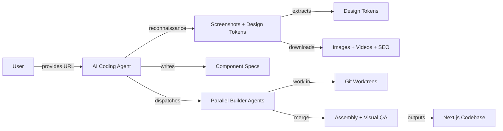
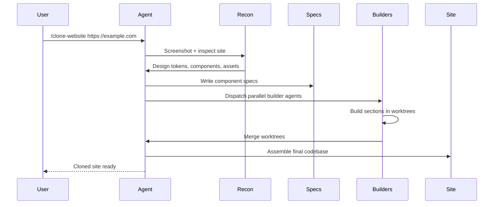

# AI Website Cloner Template

Reusable template for reverse-engineering any website into a clean, modern Next.js codebase using AI coding agents. Point at a URL, run `/clone-website`, and the AI agent reconstructs every section.

## Overview

A Next.js 16 + shadcn/ui + Tailwind CSS v4 base pre-scaffolded for AI-driven website cloning. Supports Claude Code, Codex CLI, Cursor, Windsurf, Gemini CLI, and other coding agents. Runs a multi-phase pipeline: reconnaissance (screenshots, design tokens), foundation (fonts, colors, assets), component specs, parallel builder agents in worktrees, and assembly with visual QA.

## Core Architecture



## System Components

| Component | Responsibility |
|-----------|---------------|
| `src/app/` | Next.js App Router routes |
| `src/components/` | React components (UI primitives + page sections) |
| `src/components/ui/` | shadcn/ui primitives |
| `src/lib/` | Utilities including `cn()` |
| `src/types/` | TypeScript interfaces |
| `src/hooks/` | Custom React hooks |
| `public/` | Downloaded images, videos, SEO assets |
| `docs/research/` | Inspection output and component specs |
| `scripts/` | Asset download and agent sync scripts |
| `.claude/skills/` | `/clone-website` skill definition |
| `AGENTS.md` | Cross-platform agent instructions |
| `CLAUDE.md` | Claude Code-specific config |

## Repository Layout

| Directory | Purpose |
|-----------|---------|
| `src/app/` | Next.js routes (App Router) |
| `src/components/` | React components and UI primitives |
| `src/lib/` | Utility functions |
| `src/types/` | TypeScript interfaces |
| `src/hooks/` | Custom hooks |
| `public/` | Downloaded assets (images, videos, SEO) |
| `docs/research/` | Design tokens, component specs, layout docs |
| `scripts/` | Asset download and sync automation |
| `.claude/skills/` | Agent skill definitions |

## Technology Stack

| Layer | Technology | Purpose |
|-------|-----------|---------|
| Framework | Next.js 16 (App Router) | React meta-framework |
| Language | TypeScript (strict) | Type safety |
| UI | shadcn/ui + Radix | Accessible component primitives |
| Styling | Tailwind CSS v4 (oklch tokens) | Utility-first CSS |
| Icons | Lucide React (replaced by extracted SVGs) | Icon system |
| Agents | Claude Code, Codex CLI, Cursor, Windsurf, etc. | AI-driven cloning |

## Requirements

- Node.js 24+
- An AI coding agent (see supported platforms)

## Configuration

| File | Purpose |
|------|---------|
| `AGENTS.md` | Cross-platform agent instructions (source of truth) |
| `CLAUDE.md` | Claude Code-specific config |
| `GEMINI.md` | Gemini CLI config |
| `components.json` | shadcn/ui configuration |
| `tailwind.config.ts` | Tailwind CSS v4 configuration |
| `next.config.ts` | Next.js configuration |
| `tsconfig.json` | TypeScript strict mode |

## Getting Started

```bash
# 1. Use GitHub "Use this template" to create your own repo
# 2. Clone your new repo
git clone https://github.com/YOUR-USERNAME/YOUR-NEW-REPO.git
cd YOUR-NEW-REPO

# 3. Install dependencies
npm install

# 4. Start your AI agent
claude --chrome

# 5. Run the skill
/clone-website <target-url1> [<target-url2> ...]
```

## Development

```bash
npm run dev        # Start dev server
npm run build      # Production build
npm run lint       # ESLint check
npm run typecheck  # TypeScript check
npm run check      # Run lint + typecheck + build
```

## Request / Data Flow


